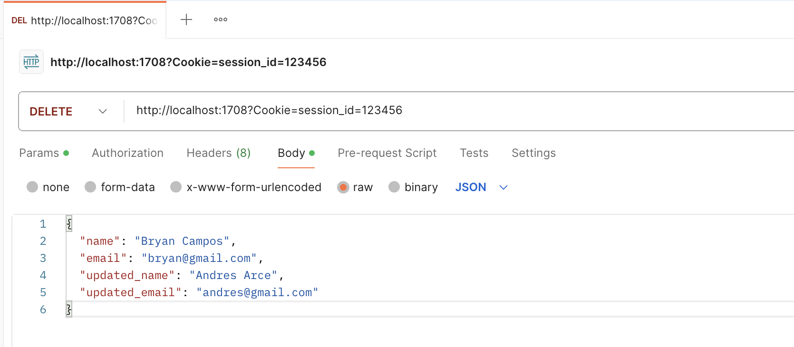
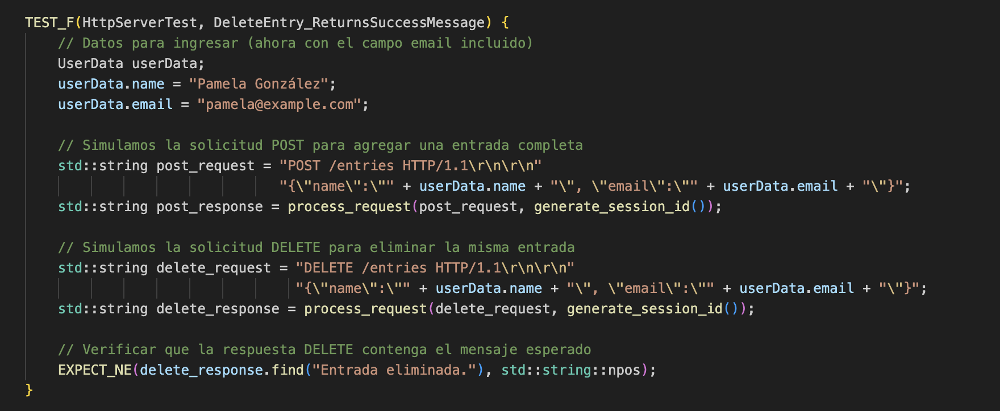
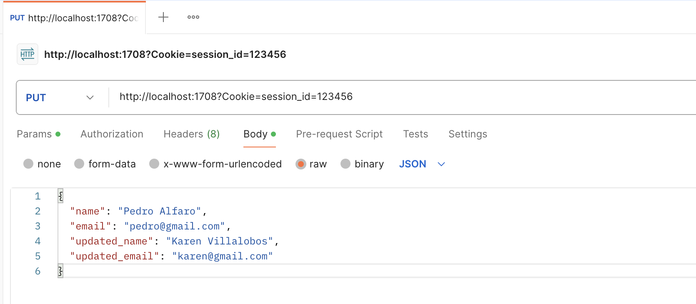
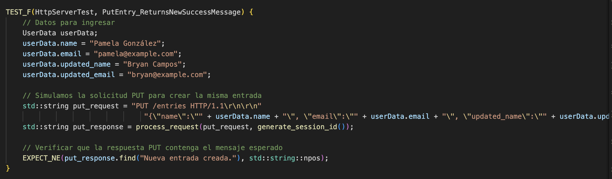
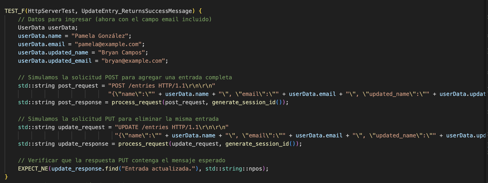
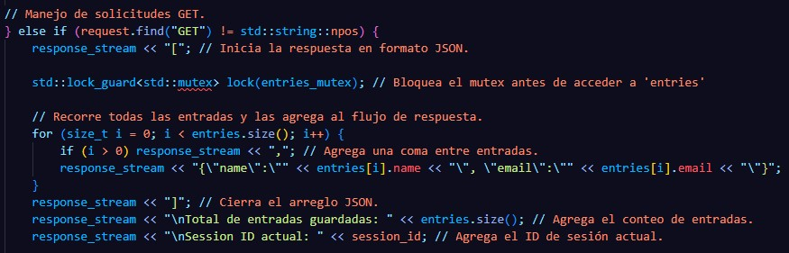
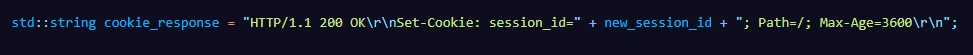
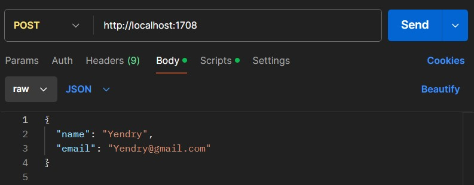

**Proyecto 1Implementación de Servidor HTTP**
Integrantes: Kenneth Chacón Pamela González Bryan Campos  

# **Descripción del diseño del servidor**

El proyecto del servidor HTTP desarrollado en C++ utiliza sockets para manejar múltiples conexiones, procesar peticiones HTTP y gestionar sesiones de usuario mediante cookies. Este servidor recibe solicitudes de clientes, procesa el contenido y envía respuestas. También soporta operaciones básicas como `POST`, `GET`, `DELETE`, `UPDATE` y `PUT` para manejar datos de usuarios en formato JSON.

## **1. Arquitectura utilizada**

### Manejo del socket

El servidor sigue una arquitectura de red cliente-servidor, siempre está atento a un puerto específico, en este caso, el **1708**. Cada vez que un cliente se conecta, se crea un socket dedicado para esa conexión.

Proceso:

El socket se crea utilizando la instrucción `socket`.

  

 

Luego, se vincula a una dirección IP y puerto específicos con `bind()`.

  

 

Finalmente, el servidor escucha conexiones entrantes con `listen()`.

  

 

### Manejo del socket

Dicha explicación realiza en el apartado “Descripción de la implementación de la concurrencia”.

## 1. Manejo de solicitudes HTTP

Las solicitudes HTTP (como `GET`, `POST`, `DELETE`, `UPDATE` y `PUT`) son manejadas por una función aparte llamada <code>handle_request</code>. Esta función revisa el contenido de la solicitud, verifica las cookies y luego procesa la solicitud según la operación solicitada. Dichas operaciones se manejan en el archivo <code>request_handler.cpp</code>.

  

 

## 2. Gestión de conexiones concurrentes

Para gestionar las conexiones concurrentes, el servidor crea un nuevo hilo para cada conexión usando la función <code>pthread_create</code>. Primero acepta la conexión del cliente y luego asigna un hilo para procesar la solicitud. Y para evitar problemas cuando varios hilos acceden a datos que se comparten, ya sea para realizar una operación <code>POST</code>, <code>DELETE</code>, <code>UPDATE</code> o <code>PUT</code>, se usa un mutex. Dicha gestión se detalla más adelante.

## 3. Implementación de las operaciones 

El servidor admite varias operaciones HTTP, y cada una está implementada en el archivo <code>request_handler.cpp</code>.

### Manejo del socket

**POST:** Esta operación permite que los clientes puedan agregar nuevas entradas con el formato {nombre, email}.

Proceso:

1. El servidor recibe la solicitud `POST` con un cuerpo en formato JSON, que contiene el nombre y el correo electrónico.

2. La función    `extract_name_and_email()` extrae estos valores del cuerpo de la solicitud y los guarda en una estructura `UserData`. 

3. Antes de agregar la nueva entrada, el servidor verifica si el formato del JSON es correcto y si ya existe una entrada con el mismo nombre y correo. Si es duplicado o el formato es incorrecto, se rechaza la solicitud. 

4. Se bloquea el acceso al vector de `entries` usando un `mutex` para evitar interferencias con otras operaciones.

5. Si no es duplicado y hay espacio disponible (máximo 200 entradas), la nueva entrada se guarda en el vector `entries`.

6. Se responde al cliente con un mensaje indicando si la entrada fue guardada exitosamente o si ocurrió un error (por ejemplo, una entrada duplicada, un límite de capacidad de almacenaje o el formato de la entrada es incorrecto).

    
    
Prueba en Postman para añadir nueva entrada

En las pruebas unitarias se verifican que la operación hace las validaciones correctamente:

    
    
Pruebas unitarias para POST

**GET:** Esta operación devuelve todas las entradas almacenadas en el servidor.

Proceso:

1. El servidor recibe la solicitud `GET` y bloquea el acceso al vector de entradas usando un `mutex ` para evitar interferencias con otras operaciones que puedan estar modificando las entradas al mismo tiempo.

2. Recorre el vector `entries` y construye una respuesta en formato JSON que contiene el nombre y correo de cada entrada. 

3. La respuesta también incluye el total de entradas almacenadas y el `session_id` actual del cliente. 

4. Finalmente, el servidor envía la respuesta al cliente con los datos solicitados.

    
    
Prueba en Postman para visualizar todas las entradas añadidas

En las pruebas unitarias se verifica que despliegue un json vacío cuando no hay entradas y por otro lado, cuando se crea una entrada que devuelva el json con la entrada. 

    
    
Pruebas unitarias para GET

**DELETE:** Esta operación elimina una entrada específica almacenada en el servidor.

Proceso:

1. El servidor recibe la solicitud `DELETE`, bloquea el acceso al vector de entradas usando un `mutex` para evitar interferencias con otras operaciones que puedan estar añadiendo o modificando las entradas al mismo tiempo.

2. Busca la entrada correspondiente en el vector utilizando algún identificador único, como el nombre o el ID de la entrada. 

3. Si encuentra la entrada, la elimina del vector y construye una respuesta que confirma la eliminación exitosa. 

4. Finalmente, el servidor envía una respuesta al cliente indicando que la entrada ha sido eliminada o, si no se encontró, un mensaje de error.

    
    
Pruebas unitarias para DELETE

**Prueba 1:** DeleteEntry_ReturnsSuccessMessage 

Esta prueba verifica el comportamiento del servidor HTTP cuando se realiza una solicitud DELETE para eliminar una entrada previamente añadida.

1.	Simulación de Inserción con `POST`:
<ul><li>Primero, se simula una solicitud <code>POST</code> para añadir una nueva entrada al sistema. El nombre y el correo electrónico de la usuaria, en este caso "Pamela González" con el correo "pamela@example.com", son enviados en el cuerpo de la solicitud. 
<li>La respuesta de esta solicitud es almacenada, aunque no se realiza ninguna verificación inmediata sobre ella.</ul>

2. Simulación de Eliminación con DELETE:
<ul><li>Luego, se simula una solicitud <code>DELETE</code> para eliminar la misma entrada que se ha agregado previamente. Nuevamente, los detalles de la usuaria se envían en el cuerpo de la solicitud. 
<li>El servidor procesa la solicitud y devuelve una respuesta que indica el estado de la eliminación.</ul>

3. Verificación del Mensaje de Éxito
<ul><li>La prueba verifica que la respuesta del servidor contiene el mensaje "Entrada eliminada." como parte del contenido, lo que confirma que el servidor pudo eliminar exitosamente la entrada solicitada.</ul>

    

**Prueba 2:** DeleteEntry_ReturnsFailMessage 

Esta segunda prueba verifica el comportamiento del servidor HTTP cuando se realiza una solicitud DELETE para eliminar una entrada que no existe en el sistema.

1. Simulación de Eliminación sin Inserción Previa:
<ul><li>En este caso, no se realiza ninguna solicitud  <code>POST</code> previa para añadir la entrada. En lugar de ello, se intenta directamente eliminar una entrada utilizando una solicitud DELETE con los mismos datos de la usuaria "Pamela González". 
</ul>

2. Verificación del Mensaje de Error
<ul><li>Dado que la entrada no existe, el servidor debería responder con un mensaje que indique el fallo en la operación de eliminación. La prueba verifica que la respuesta contiene el mensaje "Entrada no encontrada.", confirmando que el servidor no pudo encontrar la entrada solicitada para eliminarla.</ul>

    

**PUT:** Esta operación actualiza una entrada existente o crea una nueva si no se encuentra la entrada. 

Proceso:

1. El servidor recibe la solicitud `PUT`, bloquea el acceso al vector de entradas usando un `mutex` para evitar conflictos con otras operaciones concurrentes. 

2. Verifica si ya existe una entrada con el identificador proporcionado en la solicitud. Si encuentra la entrada, actualiza sus datos con los nuevos valores proporcionados en el cuerpo de la solicitud.  

3. Si no encuentra la entrada, crea una nueva y la añade al vector.  

4. El servidor envía una respuesta indicando si la entrada fue actualizada o si se creó una nueva entrada.

    
    
Pruebas unitarias para PUT

**Prueba 1:** PutEntry_ReturnsSuccessMessage 

Esta prueba verifica que el servidor HTTP maneje correctamente la actualización de una entrada existente cuando se realiza una solicitud PUT.

1.	Simulación de Inserción con `POST`:
<ul><li>Primero, se simula una solicitud <code>POST</code> para añadir una nueva entrada al sistema. Los datos incluyen el nombre "Pamela González" y el correo "pamela@example.com", junto con los valores actualizados "Bryan Campos" y bryan@example.com. 
<li>La respuesta de la solicitud POST no se verifica en este punto, simplemente se utiliza para crear la entrada en el servidor.</ul>

2. Simulación de Actualización con PUT:
<ul><li>Después, se simula una solicitud <code>PUT</code> para actualizar la entrada que se añadió previamente. Los valores originales y los valores actualizados se envían nuevamente en el cuerpo de la solicitud, como parte del protocolo<code>PUT</code>
<li>El servidor procesa la solicitud y devuelve una respuesta que indica si la actualización fue exitosa.</ul>

3. Verificación del Mensaje de Éxito
<ul><li>La prueba asegura que la respuesta del servidor contiene el mensaje "Entrada actualizada.", lo cual confirma que el servidor pudo actualizar la entrada existente con los nuevos datos proporcionados.</ul>

    

**Prueba 2:** PutEntry_ReturnsNewSuccessMessage 

Esta segunda prueba verifica que el servidor HTTP maneje correctamente la creación de una nueva entrada cuando se realiza una solicitud PUT en un caso donde la entrada no existía previamente.

1. Simulación de Inserción Directa con PUT
<ul><li>En esta prueba, no se realiza ninguna solicitud <code>POST</code> antes de la solicitud <code>PUT</code>. Se simula directamente la solicitud <code>PUT</code>, intentando crear una nueva entrada con los datos de la usuaria "Pamela González", pero también especificando los valores actualizados "Bryan Campos" y bryan@example.com.
</ul>

2.	Verificación del Mensaje de Creación
<ul><li>Dado que la entrada no existía previamente, el servidor debe interpretar la solicitud PUT como una instrucción para crear una nueva entrada. La prueba verifica que la respuesta contenga el mensaje "Nueva entrada creada.", lo cual confirma que el servidor ha creado exitosamente una nueva entrada con los datos proporcionados.</ul>

    

**UPDATE:** Esta operación modifica parcialmente una entrada existente en el servidor. 

Proceso:

1. El servidor recibe la solicitud `UPDATE`, bloquea el acceso al vector de entradas usando un `mutex` para evitar interferencias con otras operaciones. 

2.	Busca la entrada correspondiente en el vector utilizando el identificador único. Una vez encontrada, solo los campos especificados en la solicitud son actualizados, mientras que los campos restantes permanecen sin cambios. 

3. El servidor construye una respuesta confirmando que la entrada ha sido actualizada y envía dicha respuesta al cliente.

    
    
Pruebas unitarias para UPDATE

Esta prueba unitaria verifica que el servidor HTTP maneje correctamente la actualización de una entrada existente cuando se realiza una solicitud UPDATE.

1.	Simulación de Inserción con `POST`:
<ul><li>Primero, se simula una solicitud <code>POST</code> para añadir una nueva entrada al sistema. Los datos incluyen el nombre "Pamela González" y el correo "pamela@example.com", junto con los valores actualizados "Bryan Campos" y bryan@example.com. 
<li>La respuesta de la solicitud POST no se verifica en este punto, simplemente se utiliza para crear la entrada en el servidor.</ul>

2.	Simulación de Actualización con UPDATE:
<ul><li>Después, se simula una solicitud <code>UPDATE</code> para modificar la entrada que se agregó previamente. En este caso, los datos enviados en el cuerpo de la solicitud incluyen tanto los valores originales como los valores actualizados.
<li>El servidor procesa la solicitud y devuelve una respuesta que indica si la actualización de la entrada fue exitosa.</ul>

3. Verificación del Mensaje de Éxito
<ul><li>La prueba asegura que la respuesta del servidor contiene el mensaje "Entrada actualizada.", lo cual confirma que la operación de actualización fue exitosa y que el servidor ha aplicado correctamente los nuevos valores a la entrada existente.</ul>

    

  

# **Descripción de la Implementación de la Concurrencia**

La concurrencia en el servidor se gestiona mediante el uso de hilos (*threads*) proporcionados por la biblioteca `pthread`. El objetivo de usar hilos es permitir que múltiples solicitudes de clientes se procesen de manera simultánea, mejorando la eficiencia y evitando que el servidor se bloquee mientras maneja varias conexiones.

### **1. Manejo de Hilos (Threads)**

El servidor crea un nuevo hilo para cada cliente que se conecta, utilizando la función `pthread_create`. Este hilo ejecuta la función `handle_request`, que se encarga de gestionar la solicitud del cliente.

### Proceso de Creación de Hilos:

<ul><li>El servidor acepta una nueva conexión mediante <code>accept()</code> y, una vez aceptada, crea un hilo utilizando <code>pthread_create</code>.
<li>Cada hilo maneja una solicitud de manera independiente, lo que permite que el servidor continúe aceptando nuevas conexiones sin esperar a que terminen las anteriores.</ul>

    
    
Manejo de Hilos

En la imagen anterior:<ul><li><code>pthread_create</code> crea un nuevo hilo para manejar la solicitud del cliente.
<li><code>pthread_detach</code> desvincula el hilo, lo que permite que se elimine automáticamente cuando termina su tarea, evitando la acumulación de recursos.</ul>

### **2. Mitigación de Bloqueos y Condiciones de Carrera**

En el servidor, “entries” es un recurso compartido que almacena las entradas de los usuarios. Para evitar condiciones de carrera, se implementó un mutex que garantiza que solo un hilo pueda acceder a “entries” a la vez.
  
Se utilizó <code>std::lock_guard<std::mutex></code> para la gestión del mutex, lo que permite un manejo automático y seguro del bloqueo. Cuando un hilo accede a <code>entries</code>, el mutex se bloquea automáticamente a través de <code>lock_guard</code>, y se libera cuando el hilo termina su operación.
  
En el siguiente código, se usa un mutex para garantizar el acceso seguro al recurso compartido <code>entries</code> cuando se maneja una solicitud GET.

    
    
Mitigación de bloqueos

<code>std::lock_guard<std::mutex> lock(entries_mutex);</code> bloquea el mutex <code>entries_mutex</code> para que solo un hilo acceda a <code>entries</code> a la vez. Así, se evitan condiciones de carrera.
  
El bloqueo se libera automáticamente cuando el bloque de código termina, asegurando la sincronización correcta entre hilos y previniendo posibles deadlocks, ya que el mutex no permanece bloqueado más tiempo del necesario.
  

# **Manejo de Cookies**

El servidor gestiona cookies de sesión mediante el uso del encabezado HTTP <code>Set-Cookie</code>. A través de este encabezado, el servidor puede crear, enviar, almacenar y eliminar cookies que mantienen el estado de la sesión del usuario en solicitudes futuras.

### **1. Creación de Cookies**
Cuando el servidor recibe una solicitud HTTP y no se detecta una cookie de sesión (<code>session_id</code>), el servidor genera un nuevo ID de sesión utilizando la función <code>generate_session_id()</code>. Este ID se envía al cliente como una cookie en la respuesta HTTP.

### Proceso de Creación:

<ul>
    <li>Si no se encuentra un <code>session_id</code> en la solicitud, se genera un nuevo ID de sesión.</li>
    <li>El servidor envía el nuevo <code>session_id</code> al cliente mediante el encabezado <code>Set-Cookie</code> en la respuesta.</li>
</ul>

    

En la imagen anterior:  <ul><li>Si no se encontró un <code>session_id</code>, se llama a <code>generate_session_id()</code> para crear un nuevo ID de sesión único.</li></ul>

    
    
Lógica de generate_session_id() para crear un ID aleatorio 

### **2. Almacenamiento de Cookies**
Las cookies son almacenadas por el navegador o cliente una vez que se reciben en la respuesta HTTP. En cada solicitud posterior, el cliente envía la cookie <code>session_id</code> en el encabezado <code>Cookie</code>, lo que le permite al servidor identificar de manera única la sesión del cliente.

### Proceso de Almacenamiento en el Cliente:

<ul>
    <li>Si el cliente ya tiene una cookie de sesión, la enviará en cada solicitud dentro del encabezado <code>Cookie</code>.</li>
    <li>El servidor extrae este <code>session_id</code> de la solicitud para identificar la sesión del cliente y evitar generar un nuevo ID de sesión.</li>
</ul>

    
    
Almacenamiento de Cookies

En el código anterior:
<ul>
    <li>Se busca el encabezado <code>Cookie</code> en la solicitud para extraer el <code>session_id</code>, si no se encuentra la cookie, el servidor genera un nuevo ID de sesión.</li>
</ul>

### **3. Eliminación de la Cookie**

La eliminación de las cookies se maneja por medio de expiración, es decir, tienen una duración limitada en el tiempo. La duración se define en el parámetro <code>Max-Age</code>; por ejemplo, <code>Max-Age=3600</code> indica que la cookie expira automáticamente después de 3600 segundos, es decir, una hora. Una vez transcurrido ese tiempo, el cliente ya no enviará la cookie, lo que obliga al servidor a generar una nueva en la siguiente interacción.

    
    
Código que define la expiración después de una hora

  

# **Estructura de directorios y archivos**

    
    
Estructura de archivos

**1. server.cpp**: Es la parte más importante del servidor. Aquí se manejan las conexiones de red, se crean hilos para atender las solicitudes de los clientes y se coordina todo el funcionamiento principal del servidor.

**2. request_handler.h** y **request_handler.cpp**: Estos archivos definen y manejan las operaciones clave del servidor HTTP (GET, POST, DELETE, PUT, UPDATE). Aquí es donde también se asegura el manejo correcto de sesiones mediante cookies y se controlan los bloqueos con mutex.

**3. tests.cpp**: En este archivo se implementan las pruebas unitarias utilizando Google Test. Este archivo verifica que todas las operaciones del servidor (GET, POST, DELETE, PUT, UPDATE) funcionen correctamente y, además, incluye pruebas de concurrencia y de manejo de cookies.

**4. Docker**, **docker-compose** y **Makefile**: Archivos necesarios para la ejecución del proyecto y las pruebas unitarias.
  

# **Instrucciones de Ejecución del Proyecto**

**Para ejecutar el proyecto:**

1. Tener instalado Docker.

2. Si se utiliza Visual Studio, abrimos la carpeta del proyecto en VS y seguidamente abrimos la terminal. 

3. Corremos el siguiente comando: `bash docker-compose build `

4. Si queremos ejecutar el servidor, escribimos y ejecutamos el siguiente comando: `bash docker-compose up http_server`

5. Si queremos correr las pruebas unitarias, escribimos y ejecutamos el siguiente comando: `bash docker-compose up tests` 

**Para probar el servidor en Postman:** 

1. La URL: 

  

 

2. Si se desea colocar la cookie manualmente, antes de realizar cualquier operación. 

  

 

3. GET: 

  

 

4. POST: 

  

 

5. DELETE: 

  

 

6. UPDATE: 

  

 

7. PUT: 

  

. GET: 

  

  

# **Referencias**

1. Trung, V. (2022, diciembre 4). *Http-server*. GitHub. [https://github.com/trungams/http-server](https://github.com/trungams/http-server)
2. Alexia, S. (2024, abril 2). *Simple-webserver*. GitHub. [https://github.com/alexiarstein/simple-webserver](https://github.com/alexiarstein/simple-webserver)
3. Programmer Egg. (2023, febrero 2). *How to create Web Server in C++ under 600s – Tutorial [Video]*. YouTube. [https://www.youtube.com/watch?v=VlUO6ERf1TQ&t=292s&ab_channel=ProgrammerEgg](https://www.youtube.com/watch?v=VlUO6ERf1TQ&t=292s&ab_channel=ProgrammerEgg)
